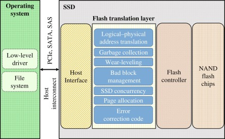

# FTL
- Flash Translation Layer
- Flash Memory를 보조 기억장치로 사용할 수 있게 해주는 Mapping 기술
- SSD의 Controller에 위치

## FTL의 역할
- Flash Memory의 각 Sector들의 수명 효율 개선
- Disk I/O의 동작 지원

## FTL Architecture
  

## SSD의 구조
- SSD : Solid State Drive
### NAND FLASH MEMORY CELL
- SSD는 Flash Memory를 기반으로한 저장 매체
- Floating Gate 트랜지스터에 전압을 가해 bit를 저장하거나 읽는다
- Cell 종류에 따라 한 Cell에 1bit(SLC: Single Level Cell), 2bit(MLC), 3bit(TLC) 저장 가능
- P/E(Program / Erase, 쓰기 / 지우기) 과정에서 Cell이 마모되어 수명 제한이 있다
- 열에 의해 데이터를 잃을 수 있다
- 속도 비교(당연히 제품마다 상이하므로 상대적으로 이해하기)
  - Read  : 25μs
  - Write : 250μs
  - Erase : 1500μs

### SSD의 구성
  
- Host Interface : SATA, PCIe(NVMe) 등
- SSD Controller는 자체 Processor와 RAM을 이용해 역할을 수행한다

## 성능 지표
### Pre-conditioning
- SSD는 지속적인 랜덤쓰기를 수행하면 30분 정도 후 급격히 Throughput이 감소한다
  - Garbage Collection이 사용자의 요청을 따라가지 못하기 때문
- 최악의 상황을 가정하기 위해 Pre-conditioning을 사용한다
- 벤치 마크 결과를 비판적인 시각으로 바라보자

## Operation
### Read & Write & Erase
- Cell 단위의 Random Access는 불가능
1. **Read**는 **Page** 단위로 실행
  - SSD는 NAND Flash의 특성상 Page 단위로 Data에 접근할 수 있다
2. **Write**는 **Page** 단위로 실행 (Write는 Program이라고 하기도 한다)
  - 1 Byte의 data를 Write 하더라도 Page 단위로 작성된다
  - 이런 불필요한 Write Overhead를 'Write Amplication'이라고 한다
3. **Erase**는 **Block**단위로 실행
  - 
4. 

