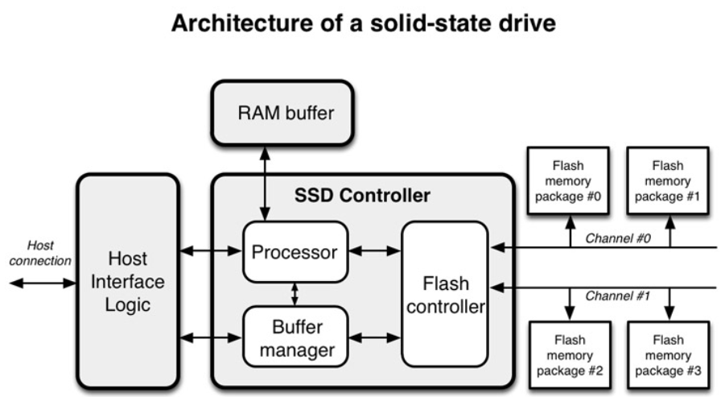

# FTL
- Flash Translation Layer
- Flash Memory를 보조 기억장치로 사용할 수 있게 해주는 Mapping 기술
- SSD의 Controller에 위치

## FTL의 역할
- Flash Memory의 각 Sector들의 수명 효율 개선
- Disk I/O의 동작 지원(HDD와 동일한 Host Interface 지원)
- Logical Block Mapping : 현재의 LBA는 HDD에 최적화 되어 있다. Nand Flash에도 동일하게 적용되도록
- Garbage Collection

## FTL Architecture
  

## SSD의 구조
- SSD : Solid State Drive
### NAND FLASH MEMORY CELL
- SSD는 Flash Memory를 기반으로한 저장 매체
- Floating Gate 트랜지스터에 전압을 가해 bit를 저장하거나 읽는다
- Cell 종류에 따라 한 Cell에 1bit(SLC: Single Level Cell), 2bit(MLC), 3bit(TLC) 저장 가능
- P/E(Program / Erase, 쓰기 / 지우기) 과정에서 Cell이 마모되어 수명 제한이 있다
- 열에 의해 데이터를 잃을 수 있다
- 속도 비교(당연히 제품마다 상이하므로 상대적으로 이해하기)
  - Read  : 25μs
  - Write : 250μs
  - Erase : 1500μs

### SSD의 구성
  
- Host Interface : SATA, PCIe(NVMe) 등
- SSD Controller는 자체 Processor와 RAM을 이용해 역할을 수행한다

## 성능 지표
### Pre-conditioning
- SSD는 지속적인 랜덤쓰기를 수행하면 30분 정도 후 급격히 Throughput이 감소한다
  - Garbage Collection이 사용자의 요청을 따라가지 못하기 때문
- 최악의 상황을 가정하기 위해 Pre-conditioning을 사용한다
- 벤치 마크 결과를 비판적인 시각으로 바라보자

## Operation
### Read & Write & Erase
- Cell 단위의 Random Access는 불가능
1. **Read**는 **Page** 단위로 실행
  - SSD는 NAND Flash의 특성상 Page 단위로 Data에 접근할 수 있다
2. **Write**는 **Page** 단위로 실행 (Write는 Program이라고 하기도 한다)
  - 1 Byte의 data를 Write 하더라도 Page 단위로 작성된다
  - 이런 불필요한 Write Overhead를 'Write Amplication'이라고 한다
3. **Erase**는 **Block**단위로 실행
  - Erase에 필요한 전압과 Write에 필요한 전압이 다르다
  - Erase에 더 높은 전압이 필요한데, Page 단위로 수행 시 주변 Cell에 영향을 끼칠 수 있어 Block 단위로 진행한다
  - 그래서 SSD는 Overwrite가 불가하다 
4. Pages cannot be Overwritten
  -  SSD는 'Free' 상태에서 Write 할 수 있다
  -  즉, In-Place update가 불가하다
  -  데이터의 변화(Write or Erase)가 생기면, 해당 Cell들을 'Stale'로 표시하고 새로운 곳에 작성한다
  -  이를 Read-Modify-Write라고 한다

### Write Amplification
- Write는 Page 단위로 실행되르모 Page Size와 다른 모든 Write는 부가적인 쓰기가 수행된다
1. Page Size보다 작은 데이터의 쓰기는 지양하는 것이 좋다
2. Write는 Page 단위에 맞출 수 있으면 좋다
3. 작은 데이터의 Write는 Buffering을 통해 Throughput을 높이자

### Wear Leveling
- P/E Cycle이 모든 셀에 고루 분산되도록 하는 알고리즘
- Block 선택 과정에서 특정 Block의 위치를 바꿀 수도 있는데, 이 과정에서 Write Amplification 발생
- 최선의 성능과 수명을 위해 적절한 Wear Leveling과 Garbage Collection이 필요

## Logical Block Mapping
- 호스트 영역의 논리 주소(LBA, Logical Block Address)를 NAND 플래시 메모리의 물리적 주소(PBA, Physical Block Address)로 변환해주는 역할
- LBA와 PBA로 구성된 테이블을 가진다. SSD의 RAM에 저장되며 안전을 위해 Flash Memory에도 저장된다
- Block Mapping은 Page단위로 하면 단순하고 쉽지만 많은 메모리가 요구되고, Block 단위로 하면 메모리는 적게 요구되지만 Write Amplification이 커진다. 따라서 Trade off 필요
- Hybrid 형태인 Log-Block Mapping을 주로 사용

### Log Block Mapping
- Write연산을 Log Block에 순차적으로 저장하고, Log Block에 가득차면 동일한 LBN(Log Block Number)을 갖는 Page들과 병합하여 새로운 free Block에 저장하는 방식
  1. 같은 Block의 Page들ㅇ

### Garbage Collection
- 'Stale' 상태의 페이지들이 삭제(Erase)되어 새로운 쓰기 데이터를 저장할 수 있도록 해주는 과정
- Write보다 Erase가 더 느리다. 따라서 Write를 할 때마다 Erase를 수행하면 동작이 느려진다
- 그래서 Free 상태의 Block들을 미리 만들어 놓기 위해 Garbage Collection이 수행된다
- 드물게 Write되는 Cold data와 자주 Write되는 Hot data를 분리하여 Write Amplification을 낮춘다

## Over Provisioning

