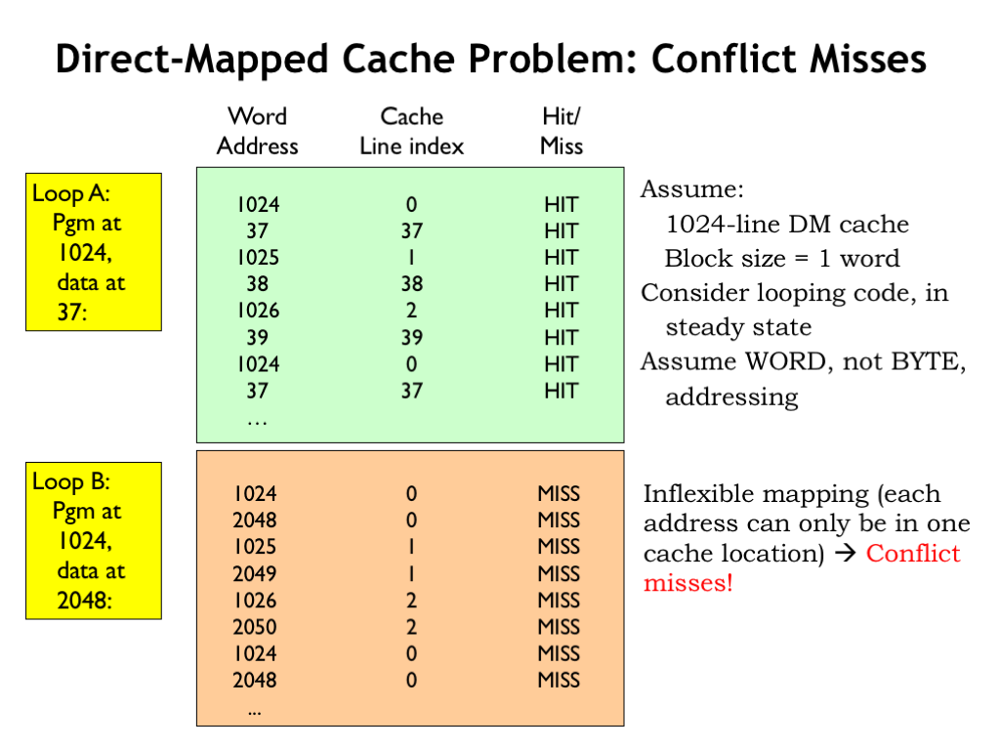
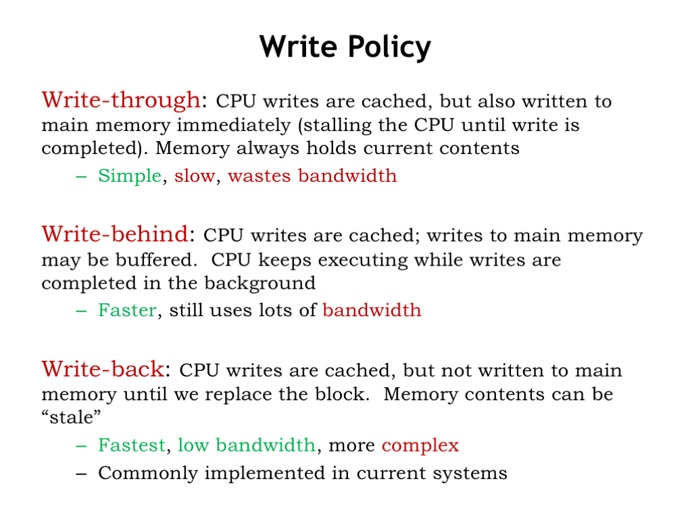
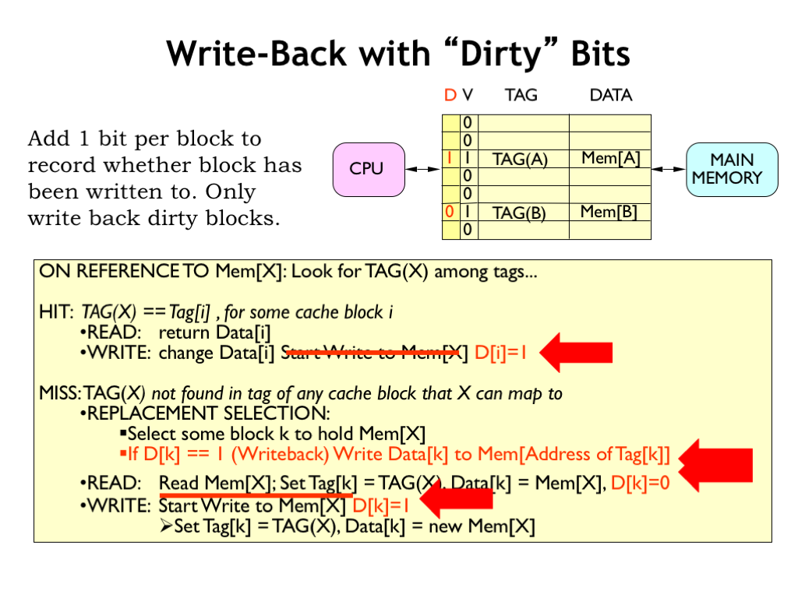

[Cache](cache)

# Cache
## Cache란?
Localty를 활용해 컴퓨터의 효율을 증대시키는 임시 저장 공간 혹은 기술.  
Memory Hierarchy에서 k Level과 K+1 Level의 관계에 Cache의 개념이 적용됨.  ex) CPU Reg <-> Cache, Cache <-> RAM, RAM <-> Local Disk
  
> Localty란?  
> Temporal Localty : 한 번 접근한 데이터는 빠른 시간 내에 다시 접근할 확률이 높은 성질  
> Spatial Localty : 접근한 데이터의 인접한 영역에 저장된 데이터도 사용할 가능성이 높은 성질

## Hit or Miss
- Cache Hit : 필요로 하는 데이터가 Load 되어 있다.
- Cache Miss : 필요로 하는 데이터가 Load 되어 있지 않다.(찾아와야 한다)

## Type of Miss
 

- Cold Miss : 데이터를 처음 사용하는 경우 보통은 Load 되어 있지 않다. 누구에게나 처음은 있는 법.
- **Conflict Miss** : Fully Associative Mapping 방식이 아닐 때, (특히 Direct Mapping 방식일 때)사용되는 데이터보다 Cache의 공간이 큼에도 Cache의 일부만을 사용해 불필요한 Miss가 발생한다. 비유하자면 바지에 주머니가 여러 갠데 강박증으로 인해 하나만 사용한다. 근데 물건은 두 개라서 하나는 꼭 손에 쥐고 다닌다.(남는 주머니 안 씀)   
그럼 Fully Associative 방식을 쓰면 되지 않나요? 그럼 Cache 자체가 느려집니다. 또 전력 소비도 커집니다.
- Capacity miss : 필요한 데이터의 용량이 Cache 보다 큰 경우.  
그럼 Cache의 크기를 키우면 되지 않나요? 그럼 Cache 자체가 느려집니다. 또 전력 소비도 커집니다.

## Cache Line

Cache Line = Data Block + Tag  

## Average Memory Access Time
Cache의 성능은 AMAT(Average Memory Access Time)으로 나타낼 수 있다.  
> AMAT = Hit Time + (Miss Rate * Miss Penalty)  

위의 식은 Cache의 Block Size에 영향을 받는다.  
  
Block Size가 커지면 가져와야할 Data의 크기도 커지므로 선형적으로 시간이 증가한다.  
DRAM의 접근에 대한 시간 자체가 크므로 Block Size의 증가에 따른 패널티는 크지 않다.  
그러나 제한된 Cache 용량에서 Block Size의 증가는 Cache Line 수의 감소를 의미합니다.  
Spatial Localty에 의해 Miss Rate가 감소하다가 RAM의 다양한 영역(Code, Data, Stack, Heap)이 요구되는 프로그램의 특성상 Cache Line의 감소로 Miss Rate가 증가하는 경향을 보입니다.  
따라서 Block Size는 Trade Off가 필요합니다.

## Cache Write Policy
> Write 결과를 언제 RAM에 반영할까?

   
1. Write Through : Write 명령을 수행하는 즉시 RAM에 반영
    - 단순하다.
    - RAM에 쓰는 동안은 CPU를 Stall하기 때문에 느리다.
    - 항상 최신의 정보가 RAM에 유지된다.
    - 일반적으로 Write연산은 전체의 10~15% 정도라고 하지만 어디까지나 평균일 뿐.
2. Write Back : Write가 사용된 Block이 교체될 때, RAM에 반영
    - 빠르지만 복잡하다.
    - Write이 되면 Dirty bit에 1로 표시
    - Cache에서 내려갈 때, Dirty bit가 1인지만 확인하면 된다.  

### 왜 Cache의 크기를 늘리지 않나요?
첫 번째로 물리적 구조의 문제입니다. SRAM의 bit당 물리적 크기는 상당합니다. 1bit를 구현하는데 6개의 트랜티스터를 사용하기 때문입니다. 따라서 Cache의 용량을 늘리기 어렵습니다.  
두 번째는 전력 소모가 큽니다. CPU가 사용하는 전원의 약 절반이 Cache에 사용되는 것으로 알고 있습니다.  
세 번째는 효율의 문제입니다. Cache의 사이즈가 커지면 Hit ratio가 증가하긴 하지만 Latency도 함께 증가합니다. 일정 크기부터는 Cahce size와 성능 향상이 정비례하지 않습니다.  

> [Reference 1](https://ocw.mit.edu/courses/electrical-engineering-and-computer-science/6-004-computation-structures-spring-2017/c14/c14s1/)  
> [Reference 2](https://parksb.github.io/article/29.html)
